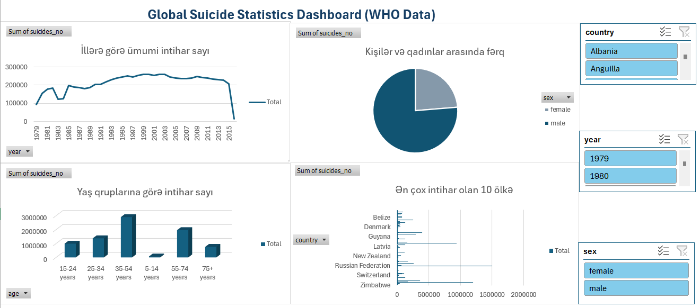

# Suicide Data Analysis

## Project Overview

This project presents an analysis of suicide statistics using Python and Excel. The dataset contains information from the World Health Organization (WHO) across different countries, years, genders, and age groups.

The main purpose of the project is to explore suicide trends over time, analyze differences between demographic groups, compare countries, and examine the relationship between population size and suicide cases.

---

## Dashboard Preview

---

## Tools Used

- Python
- Pandas
- Matplotlib
- Seaborn
- Microsoft Excel
- Jupyter Notebook
- CSV Dataset

---

## Dataset

The project uses a WHO suicide statistics dataset containing the following variables:

- Country
- Year
- Sex
- Age
- Suicides Number
- Population
- Suicides per 100k Population

The dataset provides suicide statistics across different countries and demographic groups.

---

## Research Questions

The analysis focuses on the following questions:

- Is there an overall increase or decrease in suicide cases over the years?
- Is there a difference between males and females in suicide cases?
- Which age groups have higher suicide rates?
- How do suicide trends across age groups change over time?
- Which countries have higher suicide indicators?
- How does population size relate to suicide cases?
- Which demographic groups show higher suicide indicators?

---

## Data Cleaning and Preparation

The dataset was prepared before analysis by:

- Handling missing values
- Removing duplicate records
- Converting data types
- Checking the cleaned dataset

---

## Exploratory Data Analysis

The project includes exploratory analysis of:

- Suicide case distribution
- Outlier analysis
- Suicide cases by year
- Suicide cases by gender
- Suicide cases by age group
- Age-group trends over time
- Country-level comparisons
- Population and suicide case relationships
- Demographic group comparisons

---

## Analysis Highlights

### Temporal Analysis

The analysis examines changes in suicide cases over different years and identifies periods of increase and decrease.

### Demographic Analysis

Suicide cases are compared by gender and age group to identify differences between demographic groups.

### Country-Level Comparison

Countries are compared based on total recorded suicide cases, including the countries with the highest and lowest values in the dataset.

### Population Comparison

The relationship between population size and the number of recorded suicide cases is explored using scatter plot analysis.

### Demographic Analysis by Gender and Age

Gender and age groups are combined to identify demographic groups with higher recorded suicide counts in the dataset.

---

## Excel Dashboard

An analysis dashboard was created in Microsoft Excel to present the results in a visual format.

The dashboard provides a summarized view of the analyzed suicide statistics and key patterns identified in the dataset.

---

## Repository Contents

- `Suicide_Data_Analysis.ipynb` – Python data analysis notebook
- `Suicide_Data_Analysis.xlsx` – Excel analysis and dashboard
- `who_suicide_statistics.csv` – WHO suicide statistics dataset
- `dashboard.png` – Excel dashboard preview
- `README.md` – Project documentation

---

## Conclusion

The analysis shows that suicide cases vary across years, countries, genders, and age groups. The results highlight the importance of considering demographic and population-related factors when examining suicide statistics.

The project combines Python-based exploratory data analysis with an Excel dashboard to provide both analytical and visual perspectives on the dataset.
